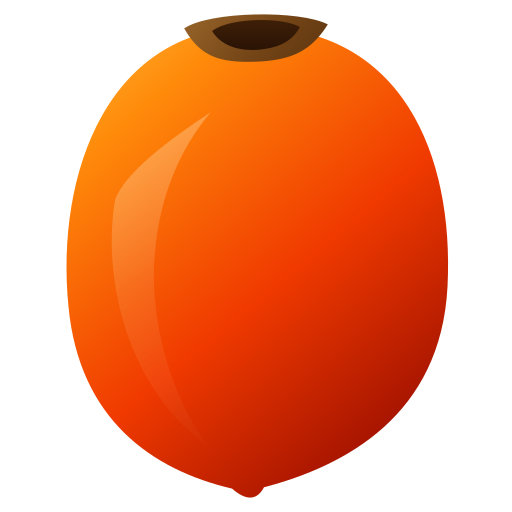
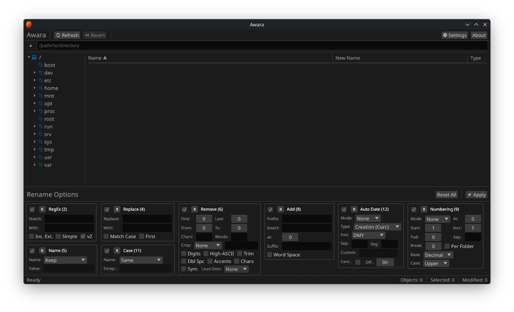
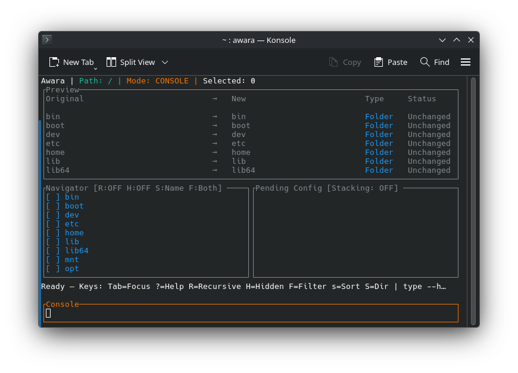

<h1>
  
  Awara
</h1>

[](https://github.com/mdeik/Awara/actions)

A powerful cross-platform batch rename utility with GUI, CLI, and TUI interfaces.
Rename hundreds of files in seconds with regex, numbering, case conversion,
filters, and more — all backed by Rust for performance and safety.

## GUI

The **GUI** (Graphical User Interface) provides a full desktop app with panels, menus, and tooltips for easy file management. See [`docs/gui.md`](docs/gui.md) for more information.


*Heavily inspired by [Bulk Rename Utility](https://www.bulkrenameutility.co.uk/)*

## TUI

The **TUI** (Terminal User Interface) provides an interactive terminal-based UI for file management. See [`docs/tui.md`](docs/tui.md) for more information.



## CLI

The **CLI** (Command Line Interface) provides a scriptable command-line tool with full flag documentation and examples. See [`docs/cli.md`](docs/cli.md) for more information.

## Installation

### Pre-built Executables (recommended)

Download the latest binary for your platform from the [releases page](https://github.com/mdeik/Awara/releases).

### From source

```bash
cargo install --git https://github.com/mdeik/Awara.git
```

### Arch Linux / CachyOS (local PKGBUILD)

A repo-local PKGBUILD is included for Arch-based distros. It builds from your local checkout (no sources are fetched) and reads the version straight from `Cargo.toml`, so a version bump is the only edit you ever make. The desktop entry and icon are installed to `/usr/share` automatically.

```bash
cd packaging/arch
makepkg -si
```

Uninstall with `pacman -R awara`.

## Usage

Running with no arguments launches the **GUI** (if available) or falls back to the **TUI**.

| Interface | Launch | Usage |
|---|---|---|
| **GUI** | Open the application normally (e.g. double-click the executable in your file manager) | Browse and select files in the side panel, build a rename pipeline by clicking operations in the toolbar, preview results live, then apply. See [`docs/gui.md`](docs/gui.md) for keyboard shortcuts and guided help. |
| **TUI** | `awara --tui` | Keyboard-driven four-pane interface. Navigate and select files, build rename operations via the config list or console commands, preview before applying. See [`docs/tui.md`](docs/tui.md) for keybindings and console commands. |
| **CLI** | `awara [OPTIONS] [FILES]...` | Express every rename operation as a flag. No interactive setup prompts — ideal for scripts and automation. See [`docs/cli.md`](docs/cli.md) for full flag reference. |

### Operation Categories

| Category | Description |
|---|---|
| **Find & Replace** | Simple text search and replace with case control |
| **Regex** | Pattern matching and replacement with capture groups |
| **Case Conversion** | Change filename or extension case (lower, upper, title, etc.) |
| **Removals** | Remove characters by position, type, or pattern; trim and crop |
| **Additions** | Add prefix, suffix, or insert text |
| **Append Folder Name** | Prepend or insert parent folder name(s) into the filename |
| **Auto Numbering** | Sequential numbering with configurable base, padding, and reset rules |
| **Name / Extension** | Replace, append, or remove extensions; set fixed name mode |
| **Move / Copy Parts** | Relocate or duplicate a substring within the filename |
| **Date & Metadata** | Insert current/file/modified dates; set post-rename timestamps |
| **File Attributes** | Set read-only, hidden, system, or archive flags after rename (support is filesystem-dependent — see `docs/cli.md`) |
| **Filters & Sorting** | Filter by name pattern, path length, type, or attributes; sort by name, date, size, extension |
| **Output & Safety** | Dry-run, undo scripts, output directory, stop-on-error, timestamp preservation |
| **Presets** | Save and reload entire configurations as JSON files |
| **Special** | Force interface mode, swap filenames, recursive traversal, depth control |

> See [`docs/gui.md`](docs/gui.md) for GUI layout, launch arguments, themes, and settings.
> See [`docs/tui.md`](docs/tui.md) for TUI keyboard shortcuts and console commands.
> See [`docs/cli.md`](docs/cli.md) for complete CLI flag documentation and examples.

## Tech Stack

| Component | Technology | Description |
|---|---|---|
| **Language** | [Rust](https://www.rust-lang.org/) (2024 Edition) | Core systems programming language |
| **GUI** | [egui](https://github.com/emilk/egui) / [eframe](https://github.com/emilk/egui/tree/master/crates/eframe) | Immediate mode GUI with native file dialogs via [rfd](https://github.com/PolyMeilex/rfd) |
| **TUI** | [ratatui](https://ratatui.rs/) / [crossterm](https://github.com/crossterm-rs/crossterm) | Terminal user interface library and cross-platform terminal backend |
| **CLI** | [clap](https://docs.rs/clap) | Command-line argument parser with derive macros |
| **Concurrency** | [rayon](https://github.com/rayon-rs/rayon) | Multithreaded data parallelism |
| **Text & Matching** | [regex](https://docs.rs/regex) / [glob](https://docs.rs/glob) / [unicode-normalization](https://docs.rs/unicode-normalization) | Pattern matching, globbing, and Unicode normalization |
| **Filesystem & I/O** | [walkdir](https://docs.rs/walkdir) / [trash](https://docs.rs/trash) | Recursive directory traversal and cross-platform recycle bin support |
| **Metadata & Time** | [kamadak-exif](https://docs.rs/kamadak-exif) / [filetime](https://docs.rs/filetime) | EXIF metadata extraction and filesystem timestamp management |
| **Serialization** | [serde](https://serde.rs/) / [serde_json](https://docs.rs/serde_json) | Preset and config serialization/deserialization |
| **Platform & Misc** | [dirs](https://docs.rs/dirs) / [ctrlc](https://docs.rs/ctrlc) / [uuid](https://docs.rs/uuid) / [libc](https://docs.rs/libc) | Config directories, signal handling, unique IDs, OS APIs |

## License

AGPL-3.0
